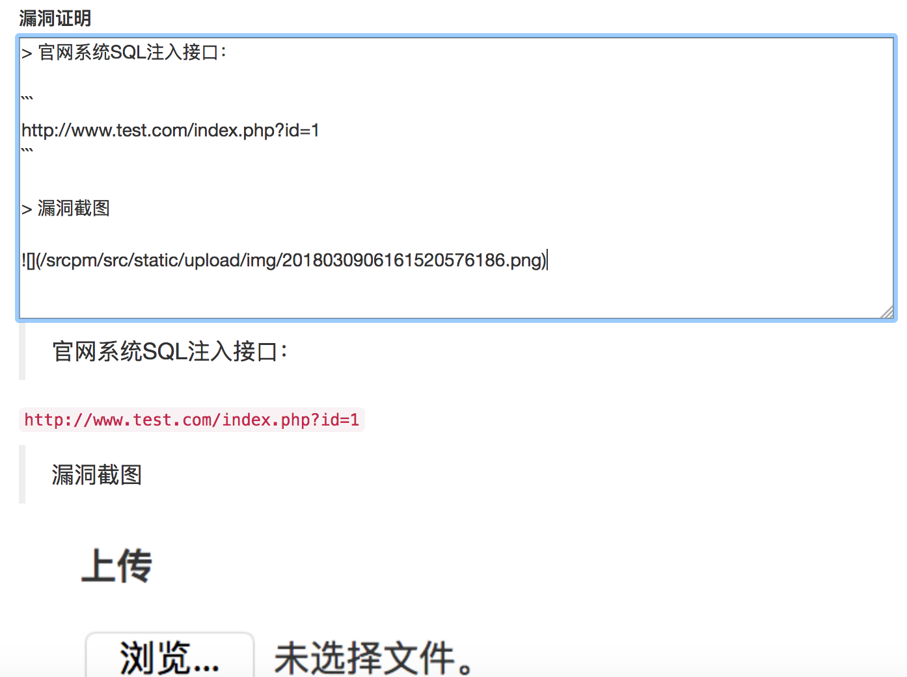

安全人员指公司安全部人员，主要指进行安全测试提交漏洞、跟踪漏洞修复的人员。

安全人员登录洞察主要工作是：
1. 注册和登录
2. 漏洞提交
3. 漏洞复测
4. 查看和修改资产信息
5. 知识库文章提交

## 注册和登录

安全人员需要注册账号后，由超级管理员修改【普通用户】权限为【安全人员】权限。

访问登录页面：

```
http://127.0.0.1:9000/srcpm/auth/login
```

点击【点击这里注册】超链接进入注册页面。

```
http://127.0.0.1:9000/srcpm/auth/register
```

## 漏洞提交

漏洞提交地址：

[http://127.0.0.1:9000/srcpm/src/vul_report_add](http://127.0.0.1:9000/srcpm/src/vul_report_add)

漏洞增加主要字段有：
* 漏洞标题：简要标题
* 关联资产：下拉选择资产
* 漏洞层面：代码或运维层面
* 漏洞类型：下拉选择漏洞类型
* Rank：0-20评分范围
* 漏洞来源：下拉选择漏洞来源
* 漏洞证明：MarkDown格式编写详细漏洞证明，输入框下方进行实时预览
* 解决方案：MarkDown格式编写详细解决方案，输入框下方进行实时预览
* 上传：上传漏洞证明中需要的截图，上传成功后将显示的截图地址按照MarkDown格式写入漏洞证明中即可。

漏洞证明编辑页面截图：



漏洞提交成功后,界面会有等待审核的消息提示，如下图所示。


漏洞审核通过后，会收到系统自动发送的新漏洞通告邮件。

## 漏洞复测

研发人员在对漏洞进行修复后，登录平台进行申请复测，相应安全人员会收到平台发送的漏洞复测申请邮件，点击邮件中的链接查看漏洞详情后进行复测。

安全人员复测完成后，在平台漏洞报告页面点击上方的【提交复测结果】按钮进入复测结果提交页面。

复测结果提交页面字段为：
* 漏洞标题：不可编辑
* 复测结果：填写复测结果说明
* 剩余Rank：复测之后对该漏洞的剩余Rank值进行评定，如果漏洞已修复完成，则剩余Rank值为0，提交后漏洞状态变更为【完成】，如果只是修复了部分，则评定剩余Rank值，提交后漏洞状态变更为【修复中】。
* 通告日期：不可编辑
* 限定修复日期：评定剩余Rank值后，平台会自动计算剩余风险值，根据剩余风险值，平台自动计算限定修复日期，不需手工设定。但有特殊场景也可手工指定修复日期。

## 查看和修改资产信息

资产各字段信息请见[使用指南-超级管理员篇](super_user.md)【资产增加】部分。

安全人员有权限可以修改资产信息，访问资产页面：

```
http://127.0.0.1:9000/srcpm/src/assets_read
```

点击相应资产条目的【系统名称】超链接即可进入资产修改页面。


## 知识库文章提交

安全人员可以进行知识库（drops）管理，提交安全知识文章到知识库。

drops管理功能菜单为：
* 新建drops
* 查看drops
* 新建分类
* 查看分类

访问URL：

```
http://127.0.0.1:9000/srcpm/drops/newdrops  #新建drops
http://127.0.0.1:9000/srcpm/drops/readdrops  #查看drops
http://127.0.0.1:9000/srcpm/drops/newcate  #新建分类
http://127.0.0.1:9000/srcpm/drops/readcate  #查看分类
```

新建drops时需要输入以下内容：
* 标题名：文章显示的标题名称
* 文章名：用来生成文章链接的名称，后台转换为文章ID，建议和标题名保持一致即可。
* tag：文章标签，多个tag用英文逗号隔开
* 分类：选择一个分类，必选。如果没有分类，需要先新建分类。

在【查看drops】页面可以对发布的drops进行【编辑】、【删除】、【下载】操作。
